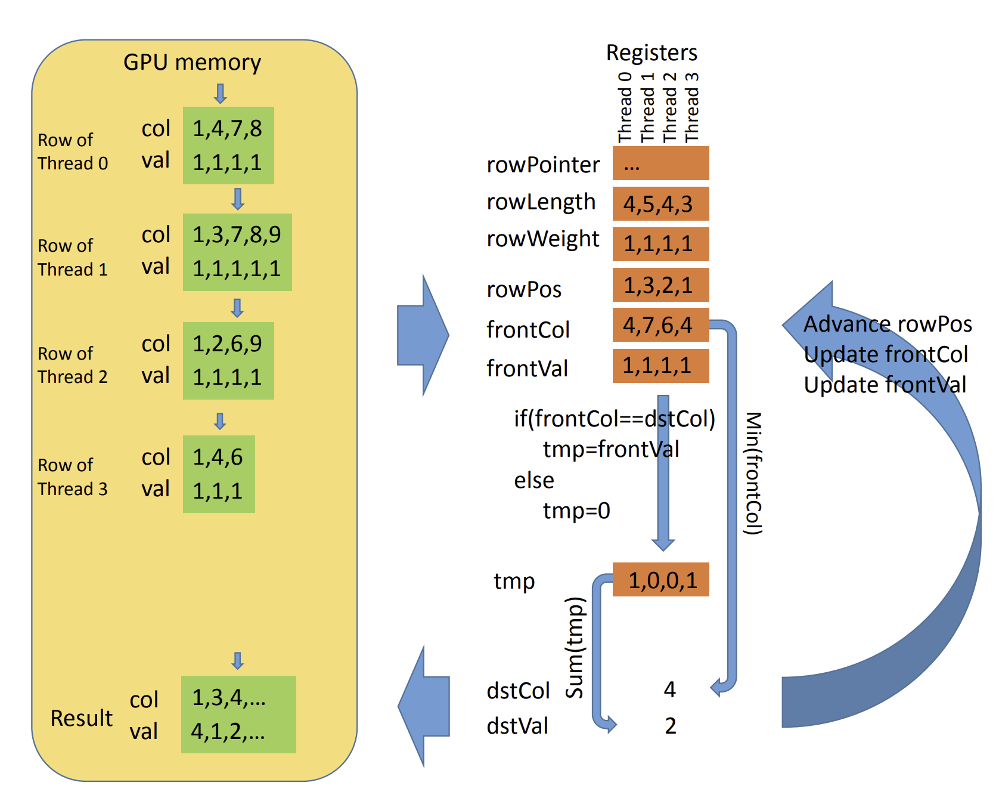

# Sparse matrix multiplication on polymorphic semiring with NVIDIA CUDA backend implemented with AnyDSL Artic

 The algorithm splts the left matrix operand into submatricies that contain no more than `warp_size` elements per row. Each warp then multiplies its own row by every row of the right operand. Inspired by [GPU-Accelerated Sparse Matrix-Matrix Multiplication by Iterative Row Merging
](https://www.researchgate.net/publication/271384388_GPU-Accelerated_Sparse_Matrix-Matrix_Multiplication_by_Iterative_Row_Merging)

## Repository structure

    .
    ├── artic                           # Artic AnyDSL frontend code for sparse spgemm
    |   ├── sparse.art                  # all the code for it, `main` function contains APSP example
    |   ├── ...               
    ├── build                           # convenient directory to place build files
    ├── cpp                             # CUDA and Impala implementation with exported wrappers to help Artic
    |   ├── test_matrix_market.cpp      # playground file with APSP example
    |   ├── ...   
    ├── include                         # include headers
    │    ├── csr_wrapper.h               # C++ wrappers for csr operations, containing CUDA, Impala, CUSPARSE, Suitesparse, IntelMKL spGEMMs
    ├── matrix_data                     # test data in `matrix_market` format
    ├── matrix_reader                   # `matrix_market` reader submodule
    ├── test                            # test folder
    ├── int_converter.py                # script to convert `integer` matrix_market to `real`
    └── README.md                       # this README

## Brief spGEMM overview

**spGEMM** multiplies two sparse matricies with **A** and **B** being the left and right operands repsectively. The result of mxm multiplication is a matrix which **i-th** row is a linear combination of the all the rows of the right operand with elements of the **i-th** row of the left operand. Given that, the algorithm first precomputes the upper bound of non-zero values of the result. In general, **i-th** CUDA **warp** operates with **i-th** row of the left operand (i.e. each row should contain less than non-zero 32 elements, this restriction could be satisfied by spliting a single spGEMM into a chain of such multipication where left operand satisfies the restriction). `preproseccRows` function calculates the length of each prospective row of the resulting matrix, populating `csr_offsets` device array with is then gets prefix-summed with **thrust**. The multiplication itsellf is performed in a similar way. The illustation could be seen in the figure which has been taken from the paper.



## Artic spGEMM on semiring to do APSP algorithm

```Rust
struct CSR [T] {
    N : u32, //cols
    M : u32, //rows
    nnz : u32, //number of nonzero elements
    values : &mut[T], //row-major
    cols : &mut[u32],
    row_index : &mut[u32]
}


struct Semiring [T] {
    zero : T,
    one : T,
    plus : fn(T,T) -> T,
    multiply : fn(T,T) -> T
}
...
#[export]
fn main() -> i32{

    let csrA = read_csr_f32("/home/alexey.tyurin/specialization/impala-worksheet/sparse/matrix_data/apsp/input");
    
    let s_mult_plus = Semiring[f32] {zero = 0.0:f32, one = 1.0:f32, plus = |x,y| x + y, multiply = |x,y| x * y };
    
    let inf = 1111111111111111111111111111111111111111111111111111111.0:f32; // this overflows to infinity;
    
    // MIN + semiring could be composed of first-class functions
    let s_min_plus = Semiring[f32] {zero = inf, one = 1.0:f32, plus = |x, y| if x <= y {x} else {y}, multiply = |x,y| x + y};

    //apsp body
    let m = csrA.M as i32;
    let mut i = 1;
    let mut res : &CSR[f32] = &csrA; 

    while(i < m - 1) {
        let res_squared = spGEMM[f32](res,res,s_min_plus); //spGEMM is computed on the GPU
        release_csr_Host[f32](res);
        res = &res_squared;
        i = i + 1;
    }

    print_csr_f32(res);
    release_csr_Host[f32](res);

    0
}

```
> Currently the type for matrix entries should be straightfuly understood by `cuda_memcpy` and be available in `CUDA` as well. So arbitrary structure could be used as long as it conforms to `memcpy` semantics and has a corresponing `csr` reader to represent a matrix with such entries.

## Build instructions

> Works on Ubuntu 20.04, and `CMAKE` files could give a brief idea about the dependencies needed.